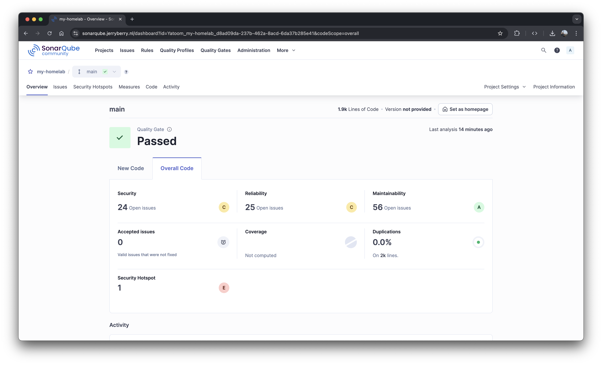
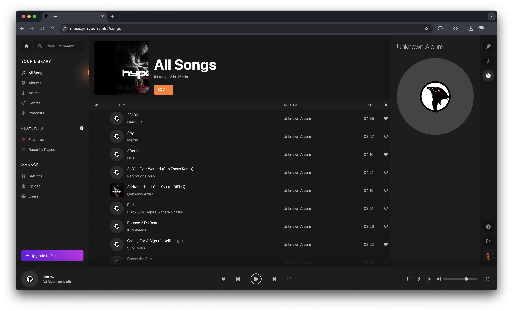

# Homelab

## Host system
Kubernetes is running on an Optiplex 3070 with an i7-9700, 16GB RAM and 1.5TB of storage.

### Microk8s
The cluster is running on microk8s. A few things have been directly enabled using `microk8s addons`.

```
addons:
  enabled:
    argocd               # (community) Argo CD is a declarative continuous deployment for Kubernetes.
    openebs              # (community) OpenEBS is the open-source storage solution for Kubernetes
    cert-manager         # (core) Cloud native certificate management
    community            # (core) The community addons repository
    dns                  # (core) CoreDNS
    ha-cluster           # (core) Configure high availability on the current node
    helm                 # (core) Helm - the package manager for Kubernetes
    helm3                # (core) Helm 3 - the package manager for Kubernetes
    hostpath-storage     # (core) Storage class; allocates storage from host directory
    ingress              # (core) Ingress controller for external access
    metrics-server       # (core) K8s Metrics Server for API access to service metrics
    observability        # (core) A lightweight observability stack for logs, traces and metrics
    storage              # (core) Alias to hostpath-storage add-on, deprecated
```

Note: `microk8s enable observability --kube-prometheus-stack-version=72.7.0` reduced the memory usage by more than half.


### Apps
- Glance 
- ArgoCD 
- Open WebUI 
- SonarQube 
- Grafana 
- N8N 
- Jellyfin 
- Koel 

### Secrets
Secrets are secured with [sealed-secrets](https://github.com/bitnami-labs/sealed-secrets). A secret file needs to be converted using: `kubeseal -f secret.yaml -o yaml > sealed.yaml`. `kubeseal` automatically uses the `kubectl` configuration to connect to the cluster.
